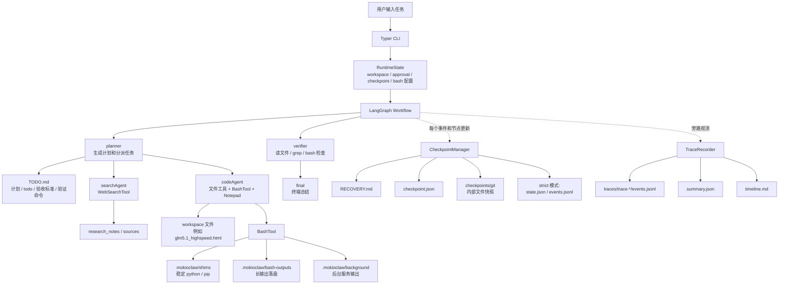
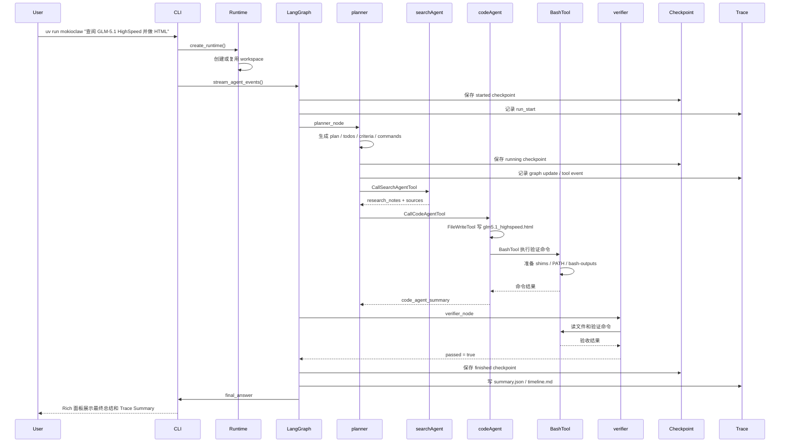
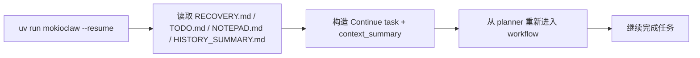
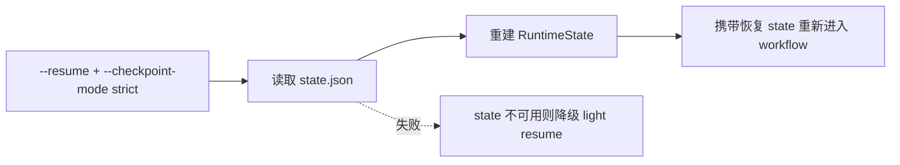

# MokioClaw Workspace 链路讲解

这篇文档用一次真实任务来解释 MokioClaw 从接收用户指令、规划、调用子 Agent、执行命令、保存 checkpoint 到最终总结的完整链路。

案例 workspace：

```text
/home/mokio/projects/MokioAgent/.mokioclaw/workspaces/workspace-20260522-213832-37ddbd
```

用户任务：

```text
能否帮我查阅一下 glm5.1 highspeed 有什么特点，并制作一个中文 html 网页给我看看
```

最终结果：

```text
workspace-20260522-213832-37ddbd/
├─ TODO.md
├─ glm5.1_highspeed.html
└─ .mokioclaw/
   ├─ bash-outputs/
   ├─ checkpoints/
   │  ├─ RECOVERY.md
   │  ├─ checkpoint.json
   │  └─ git/
   ├─ traces/
   │  └─ trace-*/
   └─ shims/
      ├─ pip
      ├─ pip3
      ├─ python
      └─ python3
```

## 一句话总览

MokioClaw 的一次运行可以理解为：

```text
CLI 创建 workspace
  -> LangGraph 节点推进任务
  -> planner 制定 TODO 和分派子 Agent
  -> searchAgent 查资料
  -> codeAgent 写文件和跑命令
  -> verifier 验收
  -> final 输出总结
  -> checkpoint 在旁边持续记录可恢复状态
```

## 总体架构图



## 一次任务的时间线



## 真实案例拆解

这个 workspace 的最终 checkpoint 显示：

```text
status: finished
mode: light
latest_node: final
attempts: 1 / 3
```

也就是说，这次任务在 light checkpoint 模式下完成，经过 1 轮 planner/codeAgent/verifier 就通过了验收。

实际完成的工作包括：

- `planner` 生成了 3 个 todo：查阅特点、制作中文 HTML、验证结果。
- `searchAgent` 收集了 5 条来源，其中包括 IT之家、鲸林向海、vLLM Ascend 文档等。
- `codeAgent` 创建了 `glm5.1_highspeed.html`，文件大小约 12 KB。
- `BashTool` 执行了文件存在、链接数量、关键词内容等检查。
- `verifier` 确认 HTML 存在、包含 2 个来源链接、内容覆盖 GLM-5.1 HighSpeed 的主要特点。
- `final` 把计划、todo、来源、验收结果、CodeAgent 总结一起输出给用户。

`TODO.md` 是当前任务的工作记忆文件。它不是简单日志，而是给 Agent 和人类一起看的任务白板：

```text
## Plan
...

## Todos
- [x] todo-1 ...

## Acceptance Criteria
...

## Verification Commands
...
```

`RECOVERY.md` 是恢复用摘要。它会把任务、计划、todo、验收标准、验证命令、来源、最近总结和近期文件整理到一个短文档里。轻量恢复时，模型主要靠它和 workspace 文件理解“之前做到哪了”。

旧版 `RECOVERY.md` 的 Task 里可能看到多层 `Continue this MokioClaw task from the checkpoint:`，通常说明这个 workspace 曾经被 `--resume` 恢复过多次。当前实现会在 light resume 时去掉已有恢复前缀，再统一加一次恢复语义，避免任务描述越来越长。

## 目录什么时候创建

### workspace 根目录

创建时机：CLI 调用 `create_runtime()` 时。

默认情况下，MokioClaw 会创建一个新的目录：

```text
.mokioclaw/workspaces/workspace-YYYYMMDD-HHMMSS-xxxxxx/
```

如果用户传入 `--workspace` 或 `--resume`，则复用指定目录。

### TODO.md

创建时机：`planner` 第一次生成计划，或调用 `TodoWriteTool` 更新计划时。

用途：

- 保存当前 plan。
- 保存 todos。
- 保存 acceptance criteria。
- 保存 verification commands。

它属于分层记忆里的 working memory，也就是“当前任务正在做什么”。

### NOTEPAD.md

创建时机：`codeAgent` 调用 `NotepadAppendTool` 时。

用途：

- 保存更自由的长期笔记。
- 记录重要发现、风险、文件、下一步。
- 压缩上下文后仍能被 history summary-store 读取。

这个案例里没有生成 `NOTEPAD.md`，说明 Agent 没有主动写长期笔记。

### HISTORY_SUMMARY.md

创建时机：`context_compressor` 真正发生上下文压缩时。

用途：

- 保存压缩后的结构化历史摘要。
- 下次节点构造 layered memory 时，会把它放进 history summary-store。

这个案例里 checkpoint 显示 `Context compression: (none)`，所以没有生成 `HISTORY_SUMMARY.md`。

### .mokioclaw/checkpoints/

创建时机：`stream_agent_events()` 开始后，`CheckpointManager.save(status="started")` 第一次执行时。

默认 checkpoint mode 是 `light`，因此会写：

```text
.mokioclaw/checkpoints/
├─ checkpoint.json
├─ RECOVERY.md
└─ git/
```

运行过程中，checkpoint 会在关键安全点刷新：开始运行、graph update、失败/审批类工具结果、中断和结束。普通 custom event 只进入 trace，不再每次都触发 workspace manifest 和 git snapshot。任务结束时会写入 `status: finished`。如果用户按 `Ctrl+C`，会写入 `status: interrupted`，CLI 会提示：

```text
uv run mokioclaw --resume <workspace>
```

### checkpoint.json

创建时机：checkpoint 安全点保存时刷新。

用途：

- 给程序读取。
- 保存 mode、status、workspace、latest_node、attempts、summary、workspace_manifest、resume_command。
- light resume 和 strict resume 都会优先参考它。

它比 `RECOVERY.md` 更结构化，但不适合直接讲给人看。

### RECOVERY.md

创建时机：checkpoint 安全点保存时刷新。

用途：

- 给人类读。
- 给 light resume 构造恢复上下文。
- 在中断后快速回答“做到哪一步了，下一步该干什么”。

### checkpoints/git/

创建时机：每次 checkpoint 保存时尝试初始化或更新。

用途：

- 这是 workspace 内部的 git 元数据目录。
- 它只给 checkpoint 文件快照使用，不会污染项目主仓库。
- 它会排除 `.mokioclaw/checkpoints/` 自身、`.venv/`、`node_modules/` 等目录。

注意：早期 checkpoint 如果 workspace 是相对路径，可能会在 `checkpoint.json` 里看到 git snapshot error。这个错误不影响 `RECOVERY.md` 和 `checkpoint.json` 恢复。当前实现已改为对 git snapshot 使用绝对路径，后续新 checkpoint 会更稳定。

### strict 模式的 state.json 和 events.jsonl

创建时机：使用 `--checkpoint-mode strict` 时。

light 模式不保存这两个文件。strict 模式会额外写：

```text
state.json
events.jsonl
```

用途：

- `state.json` 保存可序列化的 graph state，不包含不可序列化的 runtime handler。
- `events.jsonl` 保存运行时 custom event 和 graph update。
- strict resume 会优先尝试用 `state.json` 做 state-backed restart。如果文件不可读，会安全降级到 light resume。

### .mokioclaw/shims/

创建时机：第一次真正执行 `BashTool` 命令时。

更准确地说，`BashTool` 通过危险命令检查和审批检查后，会构造执行环境。构造环境时会调用 `_ensure_toolchain_shims()`，创建：

```text
.mokioclaw/shims/
├─ python
├─ python3
├─ pip
└─ pip3
```

用途：

- 把 `python` 和 `python3` 固定指向当前运行 MokioClaw 的 Python。
- 把 `pip` 和 `pip3` 固定为 `python -m pip`，必要时自动 `ensurepip`。
- 把 shims 目录放到 `PATH` 前面，减少系统 Python、conda Python、workspace venv 混用造成的漂移。

这解决的是一个很常见的问题：Agent 运行 `pip install` 装到了系统 Python，但后面 `python app.py` 用的是另一个 Python。shims 让这两个命令尽量走同一套解释器。

这个案例里 `shims` 存在，说明至少执行过一次 BashTool 验证命令。

### .mokioclaw/bash-outputs/

创建时机：第一次前台 `BashTool` 命令结束并格式化输出时。

用途：

- BashTool 会把 stdout/stderr 截断到 `MOKIO_BASH_MAX_OUTPUT_CHARS`。
- 如果输出超过限制，完整 stdout/stderr 会写到这里。
- Tool result 中会返回 `stdout_path` 或 `stderr_path`，方便 Agent 和人类继续查看。

这个案例里目录存在但为空，说明跑过 BashTool，但命令输出都比较短，没有触发长输出落盘。

### .mokioclaw/background/

创建时机：`BashTool` 使用 `run_in_background=true` 启动长时服务时。

用途：

- 保存后台任务 stdout/stderr。
- 返回 pid、stdout_path、stderr_path。
- 适合 `uvicorn`、`python -m http.server`、前端 dev server 这类不会自己退出的命令。

这个案例里没有该目录，说明没有启动后台服务。

### .mokioclaw/traces/

创建时机：`stream_agent_events()` 创建 `TraceRecorder` 后，第一次 `run_start` 写入时。

默认 trace mode 是 `on`，每次运行会创建独立目录：

```text
.mokioclaw/traces/
└─ trace-YYYYMMDD-HHMMSS-xxxxxx/
   ├─ events.jsonl
   ├─ summary.json
   └─ timeline.md
```

用途：

- `events.jsonl` 按顺序记录 run start/end、custom event、graph update、tool call/result、handoff、checkpoint 等结构化摘要。
- `summary.json` 汇总节点访问次数、工具调用数、失败工具数、审批数、checkpoint 数、最终状态和 trace errors。
- `timeline.md` 给人类快速扫一遍链路，不需要直接读 JSONL；长任务会保留开头和结尾，中间省略的事件数会明确标出。

Trace 和 checkpoint 的区别：

- checkpoint 是为了恢复任务，回答“中断后怎么继续”。
- trace 是为了观测任务，回答“这次运行发生了什么”。

Trace 默认裁剪长 payload，避免把大段 tool output 或 graph state 全量写入日志。需要关闭时可以运行：

```bash
uv run mokioclaw --trace-mode off "..."
```

## light resume 怎么工作

light checkpoint 的恢复不是“回到某个 tool call 的下一行继续跑”，而是“让模型带着恢复上下文重新进入 workflow”。

流程是：



优点：

- 实现简单。
- 对中断很稳。
- 不依赖外部数据库。
- 人类也能直接读懂恢复材料。

限制：

- 不是精确恢复到上一条 tool call。
- 恢复时会去重已有 `Continue...` 前缀，避免任务描述随着多次恢复不断变长。
- 适合教学和一般长任务恢复，不适合需要事务级精确续跑的场景。

## strict resume 怎么工作

strict checkpoint 会多保存 graph state 和事件日志。

流程是：



当前 strict 的定位是 state-backed restart，也就是尽量把已有 plan、todos、messages、sources、attempts 等 state 放回 workflow，然后从 workflow 入口重新推进；它不是精确恢复到上一个 tool call 的下一行。它比 light 带的信息更多，但仍然保持安全降级，不会因为 state 反序列化失败而让任务无法继续。

## 这套设计在教学上展示了什么

### Context Engineering

MokioClaw 不把所有信息都塞进 messages，而是分层存放：

- rules：稳定规则和运行边界。
- working memory：task、plan、todos、criteria、commands、sources、handoffs、last_error。
- history summary-store：NOTEPAD.md 和 HISTORY_SUMMARY.md。

这样可以展示“上下文不是越长越好，而是要放在正确的位置”。

### Harness Engineering

MokioClaw 把 Agent 放进更可控的执行环境：

- BashTool 有危险命令拦截。
- 高风险命令可以人类审批。
- shims 稳定 Python/pip 工具链。
- bash-outputs 保存长输出。
- background 支持长时服务。
- checkpoint/resume 让中断后可以继续。
- traces 保存结构化链路日志，方便教学演示和排障。

这展示的是“Agent 不只是模型调用，外面的运行壳同样重要”。

## 读这个 workspace 时可以怎么看

建议顺序：

1. 先看 `TODO.md`，理解任务目标和验收标准。
2. 再打开 `glm5.1_highspeed.html`，看实际交付物。
3. 再看 `.mokioclaw/checkpoints/RECOVERY.md`，理解系统如何总结进度。
4. 再看 `.mokioclaw/checkpoints/checkpoint.json`，理解程序恢复需要的结构化信息。
5. 再看 `.mokioclaw/traces/trace-*/timeline.md`，理解这次运行的节点和工具链路。
6. 最后看 `.mokioclaw/shims` 和 `.mokioclaw/bash-outputs`，理解 BashTool 的执行环境和输出管理。

这条路径基本对应了从“用户结果”到“Agent 运行机制”的逐层下钻。
